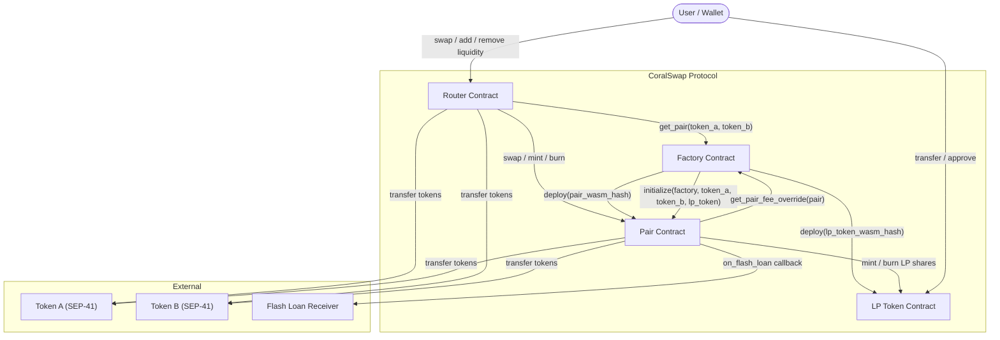

# CoralSwap Architecture

This document describes the high-level architecture of the CoralSwap V1 protocol on Soroban (Stellar).

## Contract Overview

CoralSwap is an automated market maker (AMM) built on Soroban smart contracts. The protocol consists of four core contracts and two supporting contracts that work together to provide decentralized token swaps and liquidity provision.

| Contract | Purpose |
|---|---|
| **Factory** | Deploys and registers Pair/LP Token contracts; manages protocol-wide settings and upgrades |
| **Pair** | Holds reserves for a token pair; executes swaps, mints/burns LP shares, and provides flash loans |
| **LP Token** | SEP-41 compliant token representing a liquidity provider's share of a Pair pool |
| **Router** | User-facing entry point for swaps and liquidity operations; handles multi-hop routing |
| **Flash Receiver Interface** | Trait that flash-loan receivers must implement (`on_flash_loan` callback) |
| **Mock Flash Receiver** | Test-only contract used to exercise flash-loan and malicious-receiver paths |

## Contract Interaction Diagram

## Contract Roles

### Factory

The Factory is the registry and governance hub of the protocol.

- **Pair creation**: Deploys a new Pair contract and its associated LP Token contract using deterministic salts derived from the token addresses. Stores the pair mapping in both directions (`(A,B)` and `(B,A)`).
- **Governance**: Manages a multisig signer set (1–10 signers, threshold = `ceil(n/2)`). Multisig is required for pause/unpause and upgrade operations.
- **Protocol fees**: The `fee_to_setter` address can set a protocol-wide fee recipient (`fee_to`) and fee rate (`fee_bps`, max 30 bps). Per-pair fee overrides (max 100 bps) are also supported.
- **Upgrades**: A timelocked upgrade mechanism (72-hour delay, ~51,840 ledgers) allows the Factory WASM to be replaced via `propose_upgrade` → `execute_upgrade`. Upgrades can be cancelled before execution.
- **Pause**: The protocol can be paused/unpaused by multisig, which blocks new pair creation.

### Pair

Each Pair contract holds reserves of two tokens and implements the constant-product AMM (`x * y = k`).

- **Swap**: Validates the K invariant after fee deduction. Fees are dynamic — computed from a volatility-tracking EMA with configurable baseline, min, max, ramp-up, and cooldown parameters. A per-pair fee override from the Factory takes precedence when set.
- **Mint**: Accepts token deposits and mints LP shares proportional to the deposit. On first mint, `MINIMUM_LIQUIDITY` shares are locked to the contract itself.
- **Burn**: Burns LP tokens and returns pro-rata reserves. Supports standard two-sided burn and single-sided burn (with an internal swap leg).
- **Flash Loans**: Lends reserve tokens to a receiver contract, requires repayment (principal + fee) in the same transaction.
- **Oracle**: Tracks cumulative prices for TWAP queries (`consult_twap`).
- **Reentrancy Guard**: All state-mutating swap and burn paths are protected by a storage-based reentrancy lock.

### LP Token

A SEP-41 compliant fungible token contract.

- Minted and burned exclusively by the authorized Pair contract (admin).
- Supports `transfer`, `transfer_from`, `approve`, and `permit` (off-chain signature approval).
- Admin can `pause`/`unpause` all token operations and transfer the admin role.

### Router

The user-facing contract that simplifies interaction with the protocol.

- **Swap routing**: Finds the best path across 1-hop (direct), 2-hop, and 3-hop routes using configurable hub tokens. Supports both `swap_exact_tokens_for_tokens` and `swap_tokens_for_exact_tokens`.
- **Liquidity**: `add_liquidity` computes optimal deposit amounts to preserve pool ratios; `remove_liquidity` burns LP tokens and enforces minimum output amounts.
- **Deadline enforcement**: All user-facing operations accept a deadline timestamp and revert if expired.

## V2 Architecture (Planned)

The V2 architecture is expected to introduce:

- Concentrated liquidity positions
- Enhanced oracle capabilities
- Additional pool types beyond constant-product

The current contract structure is designed to support forward evolution through the Factory's timelocked upgrade mechanism and per-pair fee flexibility.
